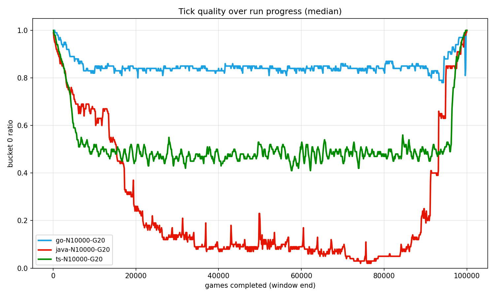
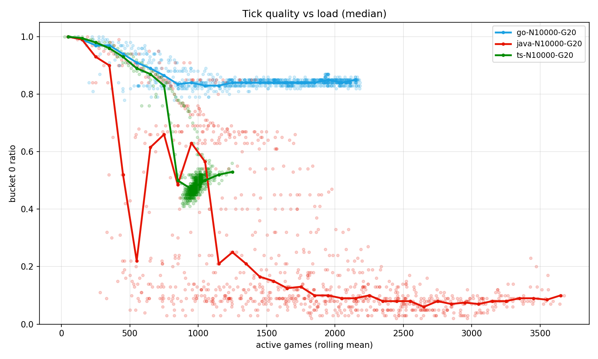
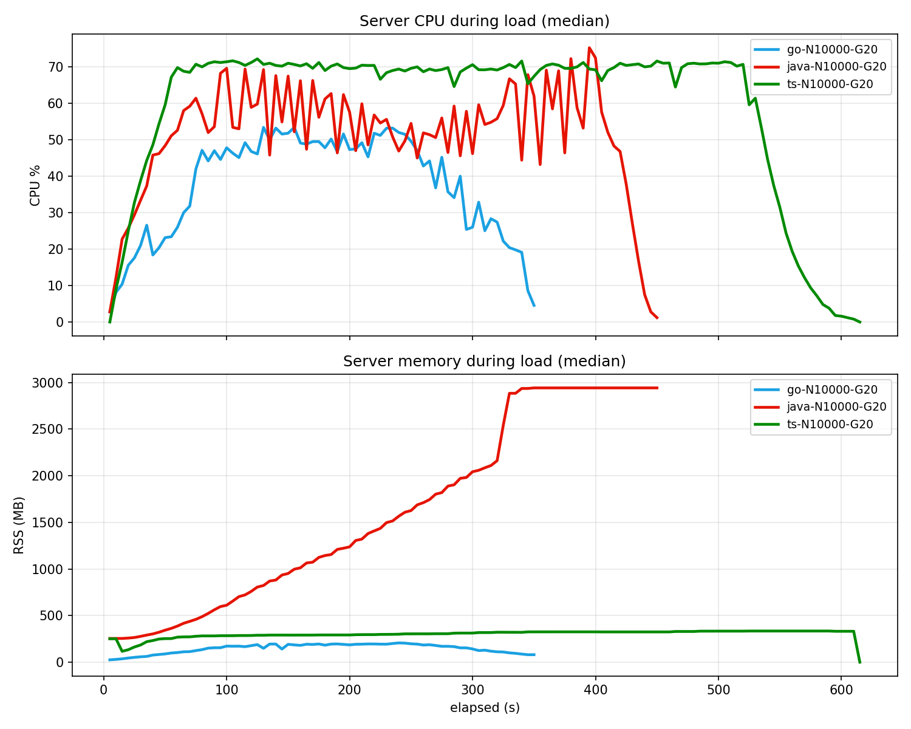

# go-runs-rest-walk

Concurrent WebSocket game server benchmark (Go vs TypeScript vs Java).

The game and the experiment's shape come from ThePrimeagen's [tyrone-biggums](https://github.com/ThePrimeagen/tyrone-biggums): a 1v1 WebSocket shooter benchmarked across languages. This study, which is also my master's thesis, turns it into a controlled experiment: reimplemented from scratch, Rust swapped for Java with virtual threads, a pinned-CPU warmup-and-three-runs benchmarking method, and bucket0 ratio, tracked against load, as the central metric instead of a composite score.

## Findings

10,000 concurrent connections, 20 games each => 100,000 games per run, three runs per platform. **bucket0 = good ticks = ticks within 16-18 ms.** The full setup is [below, in Methodology](#methodology).

**Every platform completed all 100,000 games in every run.** The differences are in _how_:

|                                               | Go            | TypeScript | Java      |
| --------------------------------------------- | ------------- | ---------- | --------- |
| bucket0 ratio, whole run (mean)               | **0.84-0.85** | 0.51-0.55  | 0.26-0.29 |
| bucket0 ratio, at saturation (rolling median) | **~0.83**     | ~0.50      | 0.08-0.10 |
| connection retries under load                 | **0**         | 69k-87k    | 0         |

- **Go** ramps down from 1.0 to ~0.83 and stays there with remarkable stability for the entire run. There are no retries, memory usage is the lowest and the total runtime is the fastest.
- **TypeScript** holds ~0.50 at saturation. It's noisier and oscillating, but far above Java's game quality. Its cost shows up at the entry instead: under full load, failed connection attempts are retried with a 50 ms backoff, 69k-87k times per run, which stretches the total runtime. Every game that runs stays mid-quality.
- **Java** finishes every game, but at saturation GC pauses push tick conformance to 0.08-0.10 for most of the run, and memory climbs until it hits the JVM's [default heap cap](https://docs.oracle.com/en/java/javase/17/gctuning/ergonomics.html) of 2.9 GB, a quarter of the 11 GB allocated to WSL. It does recover as load lessens, which suggests the degradation tracks instantaneous load rather than accumulated state.





## Methodology

1. **Environment:** WSL/Linux. Pin **server and load** to the **same CPU** (`taskset -c 0`).
2. **Warmup:** do one short load before benchmarking (required for **Java** JIT; optional but good for Go/TS - thermals, OS cache).
3. **Measure** CPU/RAM usage with `scripts/measure.sh` during the run.
4. **Load:** 10,000 connections x 20 games = 100,000 games; with 50ms stagger between connections; and 40 shards (250 conns/shard) 5ms interval burst, `-connections 10000 -games 20 -stagger 50 -burst`.
5. **Compare** rolling bucket0 at saturation, not overall ratio alone.
6. **Optional:** Repeat thrice (`run1`, `run2`, `run3`) on the same server process.

Valid run: `load finished | games_over=100000 games_failed=~0` and all clients done.

## Commands (and their order)

```bash
mkdir -p results
```

### 1. Server

```bash
cd go && taskset -c 0 go run ./cmd/server/

cd ts && taskset -c 0 npm run start

cd java && taskset -c 0 gradle run --console=plain
```

#### 1.1 Warmup

```bash
cd go && taskset -c 0 go run ./cmd/load/ \
  -connections 2000 -games 5 -stagger 50 -burst
```

### 2. Measure CPU/RAM (parallel with Load)

```bash
PID=$(lsof -t -i :37373 -sTCP:LISTEN)

./scripts/measure.sh "$PID" results/go-N10000-G20-run1-measure.csv
```

### 3. Load

Change language/tag and `run1` -> `run2` / `run3`:

```bash
cd go && taskset -c 0 go run ./cmd/load/ \
  -connections 10000 -games 20 -stagger 50 -burst \
  2>&1 | tee ../results/go-N10000-G20-run1-load.res
```

Examples: `go-N10000-G20-run1`, `ts-N10000-G20-run1`, `java-N10000-G20-run1`.

### 4. Parse and plot

```bash
cd scripts && go run ./load-parse-results/main.go \
  ../results/go-N10000-G20-run1-load.res

cd scripts && python3 benchmark.py ../results   # add --lang ro for romanian labels
```

Parsing writes `*-rolling.csv` and appends a row to `runs.csv`. `benchmark.py` writes all plots and prints a per-platform summary.

## Results layout

```text
results/
  x-load.res               # load raw stdout  -> winner lines + load heartbeats/finished
  x-rolling.csv            # load-parse-results -> rolling active_games, bucket0_ratio mean
  x-measure.csv            # measure -> pidstat CPU/MEM samples
  runs.csv                 # load-parse-results -> one summary row per parsed run
  rolling-active-games.png # benchmark.py ../results
  rolling-over-time.png    # benchmark.py ../results
  measure-cpu-mem.png      # benchmark.py ../results
```

x = `{lang}-N{connections}-G{games}[-tag]-run{n}`
